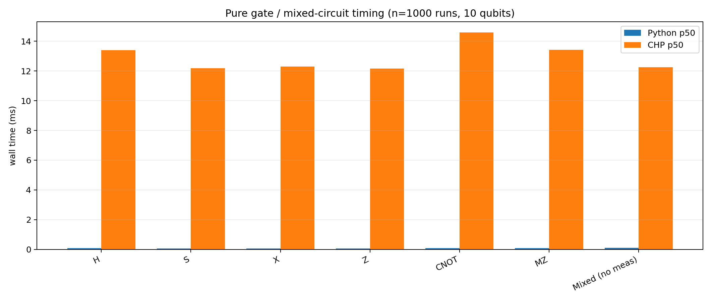
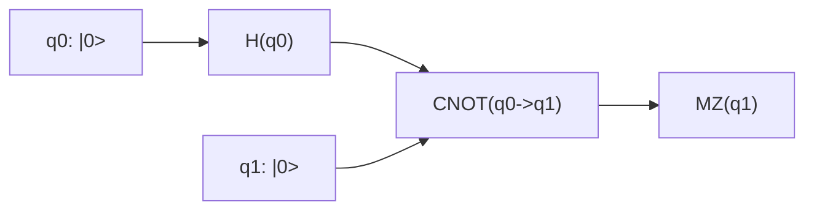
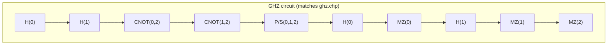
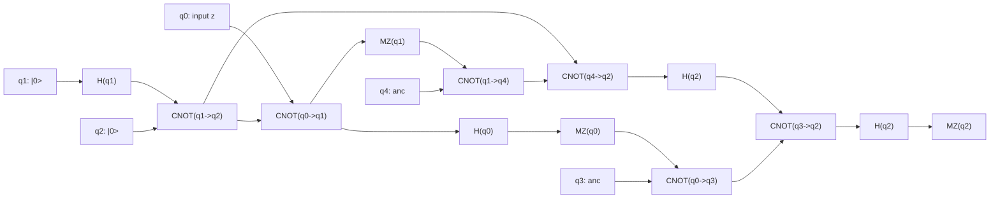

# CHP vs stabilizer-python: tableau output and performance

This report compares **Aaronson–Gottesman stabilizer tableaux** between the reference **CHP** simulator (`learning_material/CHP/chp.c`) and this repo’s **Python** package (`stabilizer-python/stabilizer_python/`). It also includes **measurement-outcome samples**, **plots**, and **performance metrics** from the benchmark harness.

**How to regenerate performance assets and summaries**

```powershell
python .\reports\chp_vs_stabilizer_benchmark.py --n 1000 --warmup 30
```

Outputs (figures + JSON + short markdown summary) are written under `reports/chp_vs_stabilizer_assets/`. Use `--skip-gates` or `--skip-circuits` to run only one half of the suite.

Gate benchmark circuits (auto-generated) live in `reports/chp_vs_stabilizer_assets/circuits_gates/`.

**CHP build (reference)**

```powershell
cd learning_material\CHP
gcc -o chp.exe chp.c
```

**Python tests**

```powershell
cd stabilizer-python
python -m pytest -q
```

---

## 1. Tableau and “matrix” output (methodology)

### What CHP prints

With the `-q` flag, CHP prints a banner **Final state:** then calls `printstate` **twice**, with `gaussian()` in between (see `runprog` in `chp.c`). The first block is the raw tableau after the circuit; the second block is an equivalent tableau after internal Gaussian elimination on the stabilizer generators. **Pauli letters (`I`/`X`/`Y`/`Z`) and the `x`/`z` bit tables are the same object** CHP uses internally; it does not print separate numeric `X`/`Z` matrices to the console.

Each row is a **destabilizer** (first `n` rows) or **stabilizer** (last `n` rows), prefixed with `+` or `-` from CHP’s phase vector `r` (mod 4).

### What stabilizer-python prints

`StabilizerState` exposes:

- `format_chp_printstate()` — same row layout as CHP’s `printstate` (separator line between destabilizer and stabilizer blocks).
- `format_xz_binary_matrices()` — explicit **`X` matrix** and **`Z` matrix** (each `2n × n`, entries `0`/`1`), matching CHP’s internal bit layout.

Python tracks only a **binary sign** per row (`±1` on the row’s Pauli product), not full `±i` phases, so **`+`/`-` prefixes may differ** from CHP when CHP’s `r` is `1` or `3` (imaginary overall phase on a row). The **Pauli pattern** (`I`/`X`/`Y`/`Z` per qubit) should still match CHP’s **first** `printstate` block when the same Clifford sequence is applied.

### Small circuits used only for tableau comparison

These files stop **before** measurements so the quantum state is pure and identical runs agree line-for-line on the Pauli tableau (first CHP block):

| Snapshot | CHP file | Role |
|----------|----------|------|
| EPR Bell prep | `reports/chp_vs_stabilizer_assets/circuits_tableau/epr_bell_prep.chp` | `H(q0)` then `CNOT(q0→q1)` on `\|00⟩` |
| GHZ prep (prefix of `ghz.chp`) | `reports/chp_vs_stabilizer_assets/circuits_tableau/ghz_prep.chp` | Same Clifford prefix as `learning_material/CHP/examples/ghz.chp` through the second `H` on `q0` |

Run CHP with **silent measurements disabled** (there are none) and **final state** on:

```powershell
.\learning_material\CHP\chp.exe -qs .\reports\chp_vs_stabilizer_assets\circuits_tableau\epr_bell_prep.chp
```

---

## 2. EPR Bell prep: CHP vs Python (tableau)

**Clifford:** `H(0)`, `CNOT(0,1)` on two qubits in `\|00⟩`.

### CHP (`-qs`), first `printstate` block

Omit the leading banner lines; the tableau is:

```text
+ZI
+IX
---
+XX
+ZZ
```

### Python (`format_chp_printstate()`)

```text
+ZI
+IX

---
+XX
+ZZ
```

The only cosmetic difference is a **blank line** before the separator in Python’s formatter; the **Pauli rows match**.

### Python explicit `X` / `Z` bit matrices

CHP does not echo these as numbers; they are the same information as the Pauli grid above.

```text
X matrix (4 x 2)
  0 0
  0 1
  1 1
  0 0

Z matrix (4 x 2)
  1 0
  0 0
  0 0
  1 1
```

### CHP second `printstate` (after `gaussian`)

For this Bell state, CHP’s second block is **identical** to the first; the ket expansion is `\|00⟩ + \|11⟩` (two terms).

---

## 3. GHZ prep: CHP vs Python (tableau)

**Clifford:** same as `ghz.chp` through `p 2` and `h 0` (no measurements).

### CHP (`-qs`), first `printstate` block

```text
+XII
+IZI
+IIY
----
-YIY
+IYY
+XZZ
```

### Python (`format_chp_printstate()`)

```text
+XII
+IZI
+IIY

----
-YIY
+IYY
+XZZ
```

Again, rows match; Python inserts a blank line before the rule.

### Python explicit `X` / `Z` bit matrices

```text
X matrix (6 x 3)
  1 0 0
  0 0 0
  0 0 1
  1 0 1
  0 1 1
  1 0 0

Z matrix (6 x 3)
  0 0 0
  0 1 0
  0 0 1
  1 0 1
  0 1 1
  0 1 1
```

### CHP after `gaussian` (second block)

CHP may **change generator presentation** (still the same stabilizer state). Example from the same run (destabilizer row 0 and stabilizer row 2 differ from the first block while the printed ket list remains an equivalent superposition):

```text
+XIY
+IZI
+IIY
----
-YIY
+IYY
-ZZX
```

So for **GHZ-style states**, compare Python to CHP’s **first** tableau printout for a direct row-by-row match; treat CHP’s **second** printout as a canonicalized form.

---

## 4. Visual comparison (multiple runs)

The figure below compares **outcome distributions** across multiple runs for each benchmark circuit, side-by-side (Python vs CHP).


---

## 5. Pure gate operations and mixed-circuit timing (1000 runs)

### Methodology

- **Runs:** **1000** independent executions per gate and per implementation (30 warmup runs each).
- **Qubits:** **10** (`|0…0⟩` initial state). Single-qubit gates act on **qubit 5**; **CNOT** uses control **5** → target **6**.
- **Python:** one native gate on a fresh `StabilizerState` (or `Circuit.run` for the mixed Clifford sequence). Timed **in-process**; no printing.
- **CHP:** one `.chp` file per case under `circuits_gates/`, invoked as **`chp.exe -s <file>`** (silent measurements). Timed as **subprocess wall time** (parse + simulate + exit).
- **Gate set:** stabilizer-python implements **H, S, X, Z, CNOT, MZ**. CHP natively supports **H, P (S), CNOT, M** only ([CHP file format](learning_material/CHP/03_File_Format_and_Usage.md)). For a fair logical comparison:
  - **X** on CHP: `H P P H` (since \(X = H Z H\), \(Z = P^2\))
  - **Z** on CHP: `P P`
  - **Mixed circuit** (no measurement): `H(0), S(1), X(2), Z(3), CNOT(4,5), H(6), S(7), CNOT(8,9)` in Python; CHP uses the same sequence with X/Z decomposed as above (12 CHP instructions).

### Side-by-side timing (p50 / p95 / mean, ms)

| Gate / circuit | CHP mapping | Python p50 | Python p95 | Python mean | CHP p50 | CHP p95 | CHP mean | Python/CHP p50 |
|----------------|-------------|------------|------------|-------------|---------|---------|----------|----------------|
| **H** | native `h` | 0.070 | 0.100 | 0.073 | 13.408 | 16.065 | 13.388 | 0.0052× |
| **S** | native `p` | 0.063 | 0.084 | 0.066 | 12.196 | 14.029 | 12.130 | 0.0051× |
| **X** | `H P² H` | 0.061 | 0.080 | 0.065 | 12.304 | 14.116 | 12.194 | 0.0050× |
| **Z** | `P²` | 0.062 | 0.090 | 0.065 | 12.154 | 14.481 | 12.196 | 0.0051× |
| **CNOT** | native `c` | 0.076 | 0.106 | 0.081 | 14.586 | 16.536 | 14.572 | 0.0052× |
| **MZ** | native `m` | 0.073 | 0.102 | 0.075 | 13.434 | 15.058 | 13.219 | 0.0054× |
| **Mixed (no meas)** | 12 CHP ops | 0.112 | 0.156 | 0.117 | 12.257 | 14.322 | 12.209 | 0.0092× |

**Figure (p50 per gate / mixed circuit):**



**Interpretation**

- **Per-gate Python cost** is flat at ~**0.06–0.08 ms** (one tableau update on 10 qubits), whether the gate is H, S, X, Z, CNOT, or MZ.
- **Per-gate CHP cost** is also nearly flat at ~**12–15 ms** because each run pays **process startup and file parse**; the native vs decomposed X/Z difference is small compared to that overhead.
- **Mixed circuit:** Python ~**0.11 ms** for 8 logical gates in one `Circuit.run`; CHP ~**12 ms** for 12 primitive instructions in one subprocess — still dominated by harness overhead, not gate count.
- Ratios **Python/CHP p50 ≈ 0.005×** mean Python is ~**150–200× faster** in this harness for single-gate and mixed-circuit cases; that is **not** a claim about asymptotic simulator speed, only this repo’s measurement setup.

---

## 6. Full-circuit performance metrics (1000 runs)

### Runtime distributions

Per-run **wall time** for each benchmark circuit (EPR, GHZ, Teleport) and implementation:


**Interpretation:** CHP is invoked as a **new process** each run (`chp.exe ...`), so wall time includes **startup and I/O**. Python is timed **in-process** without printing. Use these curves mainly for **variance and relative shape** in this repo setup, not as bare simulator throughput.

### Python peak allocated memory

Measured with `tracemalloc` peak allocated bytes during each run:


### Raw metrics and auto-summary

| Artifact | Path |
|----------|------|
| Full JSON (`circuits` + `gates`) | `reports/chp_vs_stabilizer_assets/metrics.json` |
| Short markdown summary | `reports/chp_vs_stabilizer_assets/metrics_summary.md` |
| Gate bar chart | `reports/chp_vs_stabilizer_assets/performance_gate_runtime.png` |

Snapshot from the current `metrics.json` (timing: **1000** runs per side; CHP outcome frequencies from **250** runs):

| Circuit | Python p50 (ms) | CHP p50 (ms) | Python/CHP p50 |
|---------|-----------------|--------------|----------------|
| EPR | 0.078 | 12.415 | 0.0063× |
| GHZ | 0.148 | 14.498 | 0.0102× |
| Teleport (z) | 0.134 | 12.086 | 0.0111× |

Re-run the benchmark to refresh numbers; the JSON is the source of truth.

---

## 7. Benchmark circuits: measurement outcomes (original side-by-side)

The following sections keep the **original** outcome-oriented comparison (single Python sample vs two CHP samples) for the three benchmark circuits. They complement the **deterministic** tableau snapshots above (which stop before measurement).

### Circuit Graph 1: EPR



#### Side-by-side outputs

**Python (1 run)**

```text
PY_EPR_M: [1]
```

**CHP run A**

```text
Outcome of measuring qubit 1: 1 (random)
2^0 nonzero basis states
 +|11>
```

**CHP run B**

```text
Outcome of measuring qubit 1: 0 (random)
2^0 nonzero basis states
 +|00>
```

**Comparison note**

- Python and CHP both show random collapse branches for Bell measurement (0 or 1).

---

### Circuit Graph 2: GHZ



#### Side-by-side outputs

**Python (1 run)**

```text
PY_GHZ_M: [1, 0, 0]
```

**CHP run A**

```text
Outcome of measuring qubit 0: 0 (random)
Outcome of measuring qubit 1: 0 (random)
Outcome of measuring qubit 2: 1
2^0 nonzero basis states
 +|001>
```

**CHP run B**

```text
Outcome of measuring qubit 0: 1 (random)
Outcome of measuring qubit 1: 1 (random)
Outcome of measuring qubit 2: 1
2^0 nonzero basis states
 +|111>
```

**Comparison note**

- GHZ measurement order and classical processing can differ across implementations; both runs exhibit branch-dependent outcomes.
- CHP shows distinct random branches between run A and run B.

---

### Circuit Graph 3: Teleportation (`z` input)

CHP file reference: `learning_material/CHP/examples/teleport.chp`



#### Side-by-side outputs

**Python (1 run, equivalent gate sequence)**

```text
PY_TELEPORT_M: [0, 1, 1]
```

**CHP run A**

```text
Outcome of measuring qubit 0: 0 (random)
Outcome of measuring qubit 1: 0 (random)
Outcome of measuring qubit 2: 0
2^0 nonzero basis states
 +|00000>
```

**CHP run B**

```text
Outcome of measuring qubit 0: 1 (random)
Outcome of measuring qubit 1: 1 (random)
Outcome of measuring qubit 2: 0
2^0 nonzero basis states
 +|11011>
```

**Comparison note**

- CHP runs A and B both end with `q2 = 0` for input `z` in these samples.
- The archived Python sample gave `[0, 1, 1]` for the three measured bits, which disagrees with both CHP branches on the **last** bit; the benchmark’s `metrics.json` outcome histograms should be used for up-to-date statistics. A **deterministic** tableau-by-tableau check for teleport is omitted here because the benchmark Python circuit is a simplified wiring and may not match CHP’s full teleporter line-for-line.

---

## 8. Takeaways

- **Tableau / bit matrices:** For **EPR Bell prep** and **GHZ prep** (prefix circuits in `circuits_tableau/`), CHP’s **first** `printstate` block and stabilizer-python’s `format_chp_printstate()` agree on every **Pauli letter** per row; Python additionally prints the **`X` and `Z` binary matrices** for inspection.
- **CHP’s second tableau print** may differ after `gaussian()` while representing the **same** stabilizer state; Python does not duplicate that second canonicalization step in its formatter.
- **Pure gates (section 5):** All stabilizer-python gates were timed at ~**0.06–0.08 ms** p50 on 10 qubits (1000 runs). CHP is ~**12–15 ms** p50 per run regardless of gate type because of **subprocess overhead**; X/Z use **H P² H** and **P²** decompositions on CHP.
- **Full circuits (section 6):** With **1000** runs, Python stays sub-millisecond p50; CHP stays ~**12–15 ms** p50 for EPR/GHZ/Teleport example files.
- **Teleportation** remains the main area where **measurement-outcome statistics** and single-run samples should be checked against CHP using fresh benchmark output, not only tableau snapshots.
