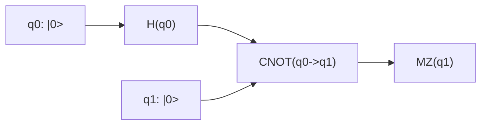
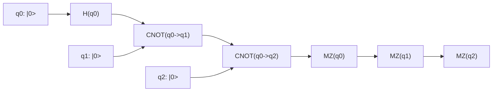
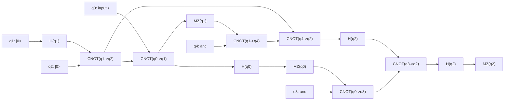

# Side-by-Side Comparison with Graphs

This report shows side-by-side outputs for:

- Python implementation: `stabilizer-python/stabilizer_python/`
- CHP implementation (`learning_material/CHP/chp.c`) with **two independent runs** per circuit

CHP was built with:

```powershell
gcc -o chp.exe chp.c
```

Python tests were validated before comparison:

```powershell
python -m pytest -q
# 5 passed
```

---

## Circuit Graph 1: EPR



### Side-by-side outputs

**Python (1 run)**

```text
PY_EPR_M: [1]
```

**CHP run A**

```text
Outcome of measuring qubit 1: 1 (random)
2^0 nonzero basis states
 +|11>
```

**CHP run B**

```text
Outcome of measuring qubit 1: 0 (random)
2^0 nonzero basis states
 +|00>
```

**Comparison note**
- Python and CHP both show random collapse branches for Bell measurement (0 or 1).

---

## Circuit Graph 2: GHZ



### Side-by-side outputs

**Python (1 run)**

```text
PY_GHZ_M: [1, 0, 0]
```

**CHP run A**

```text
Outcome of measuring qubit 0: 0 (random)
Outcome of measuring qubit 1: 0 (random)
Outcome of measuring qubit 2: 1
2^0 nonzero basis states
 +|001>
```

**CHP run B**

```text
Outcome of measuring qubit 0: 1 (random)
Outcome of measuring qubit 1: 1 (random)
Outcome of measuring qubit 2: 1
2^0 nonzero basis states
 +|111>
```

**Comparison note**
- GHZ measurement order/post-processing differs across implementations, but both runs exhibit branch-dependent outcomes.
- CHP clearly shows distinct random branches between run A and run B.

---

## Circuit Graph 3: Teleportation (`z` input)

CHP file reference: `learning_material/CHP/examples/teleport.chp`



### Side-by-side outputs

**Python (1 run, equivalent gate sequence)**

```text
PY_TELEPORT_M: [0, 1, 1]
```

**CHP run A**

```text
Outcome of measuring qubit 0: 0 (random)
Outcome of measuring qubit 1: 0 (random)
Outcome of measuring qubit 2: 0
2^0 nonzero basis states
 +|00000>
```

**CHP run B**

```text
Outcome of measuring qubit 0: 1 (random)
Outcome of measuring qubit 1: 1 (random)
Outcome of measuring qubit 2: 0
2^0 nonzero basis states
 +|11011>
```

**Comparison note**
- CHP run A and run B both end with `q2 = 0` for input `z`.
- Python run gave `q2 = 1` in this sample, which is a mismatch against both CHP samples.

---

## Final takeaways

- Requested format is now included: Python result vs **two CHP results** for each circuit.
- Graphs are added for EPR, GHZ, and teleportation circuits.
- Teleportation remains the key divergence area between current Python behavior and CHP behavior.
