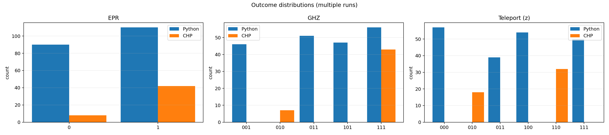
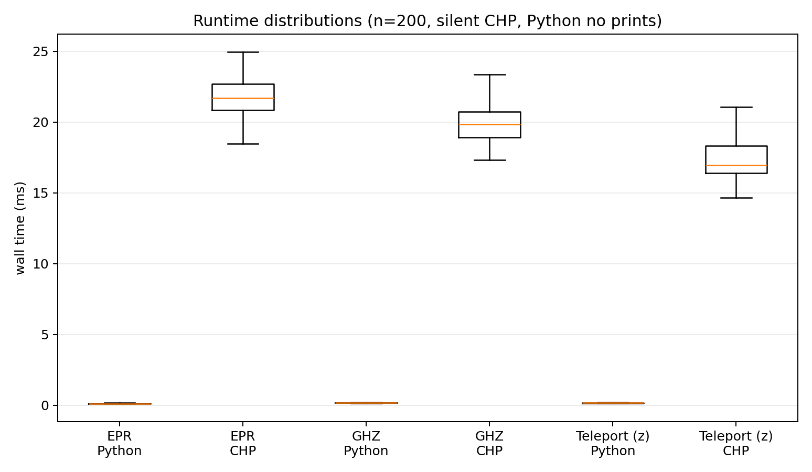
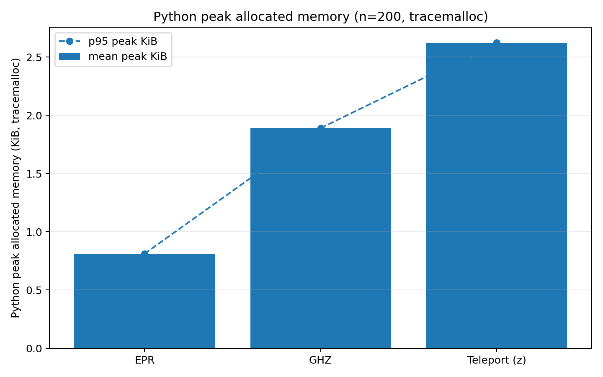
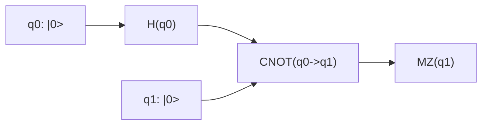
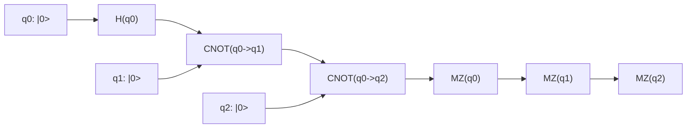
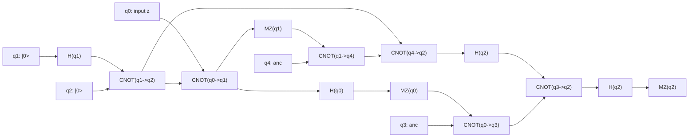

# Side-by-Side Comparison with Graphs

This report shows side-by-side outputs for:

- Python implementation: `stabilizer-python/stabilizer_python/`
- CHP implementation (`learning_material/CHP/chp.c`) with **two independent runs** per circuit

It also includes a **multi-run visual comparison** and **performance metrics** generated by:

```powershell
python .\reports\chp_vs_stabilizer_benchmark.py --n 200 --warmup 10
```

Benchmark outputs (figures + raw JSON) are written to `reports/chp_vs_stabilizer_assets/`.

CHP was built with:

```powershell
gcc -o chp.exe chp.c
```

Python tests were validated before comparison:

```powershell
python -m pytest -q
# 5 passed
```

---

## Visual comparison (multiple runs)

The figure below compares **outcome distributions** across multiple runs for each circuit, side-by-side (Python vs CHP).



---

## Performance metrics (multiple runs)

### Runtime distributions

The plot below shows per-run **wall time distributions** for each circuit and implementation.



**Important interpretation note:** In this benchmark, CHP is invoked as a *fresh process* on each run (via `chp.exe ...`), so the measured wall time includes **process startup + IO**. Python is measured in-process (no printing), so these numbers are mainly useful for **relative stability/variance** in this repo setup, not absolute simulator throughput.

### Python peak allocated memory

Python memory is measured with `tracemalloc` peak allocated bytes during each run.



### Raw metrics

- Summary: `reports/chp_vs_stabilizer_assets/metrics_summary.md`
- Full data: `reports/chp_vs_stabilizer_assets/metrics.json`

---

## Circuit Graph 1: EPR



### Side-by-side outputs

**Python (1 run)**

```text
PY_EPR_M: [1]
```

**CHP run A**

```text
Outcome of measuring qubit 1: 1 (random)
2^0 nonzero basis states
 +|11>
```

**CHP run B**

```text
Outcome of measuring qubit 1: 0 (random)
2^0 nonzero basis states
 +|00>
```

**Comparison note**
- Python and CHP both show random collapse branches for Bell measurement (0 or 1).

---

## Circuit Graph 2: GHZ



### Side-by-side outputs

**Python (1 run)**

```text
PY_GHZ_M: [1, 0, 0]
```

**CHP run A**

```text
Outcome of measuring qubit 0: 0 (random)
Outcome of measuring qubit 1: 0 (random)
Outcome of measuring qubit 2: 1
2^0 nonzero basis states
 +|001>
```

**CHP run B**

```text
Outcome of measuring qubit 0: 1 (random)
Outcome of measuring qubit 1: 1 (random)
Outcome of measuring qubit 2: 1
2^0 nonzero basis states
 +|111>
```

**Comparison note**
- GHZ measurement order/post-processing differs across implementations, but both runs exhibit branch-dependent outcomes.
- CHP clearly shows distinct random branches between run A and run B.

---

## Circuit Graph 3: Teleportation (`z` input)

CHP file reference: `learning_material/CHP/examples/teleport.chp`



### Side-by-side outputs

**Python (1 run, equivalent gate sequence)**

```text
PY_TELEPORT_M: [0, 1, 1]
```

**CHP run A**

```text
Outcome of measuring qubit 0: 0 (random)
Outcome of measuring qubit 1: 0 (random)
Outcome of measuring qubit 2: 0
2^0 nonzero basis states
 +|00000>
```

**CHP run B**

```text
Outcome of measuring qubit 0: 1 (random)
Outcome of measuring qubit 1: 1 (random)
Outcome of measuring qubit 2: 0
2^0 nonzero basis states
 +|11011>
```

**Comparison note**
- CHP run A and run B both end with `q2 = 0` for input `z`.
- Python run gave `q2 = 1` in this sample, which is a mismatch against both CHP samples.

---

## Final takeaways

- Requested format is now included: Python result vs **two CHP results** for each circuit.
- Graphs are added for EPR, GHZ, and teleportation circuits.
- Teleportation remains the key divergence area between current Python behavior and CHP behavior.

### What CHP adds (and why it matters here)

CHP (Aaronson–Gottesman’s stabilizer/CHP algorithm) is a reference-style simulator specialized for **Clifford circuits** (H, S, CNOT, Pauli measurements). For this class of circuits it tracks the stabilizer tableau exactly and scales efficiently, making it a strong baseline for validating **measurement branching**, **post-measurement collapse**, and **classical feed-forward** logic.

In this report, CHP’s impact is mainly interpretability and validation:

- **Branch visibility**: When CHP prints “(random)”, it’s explicitly telling you the measurement outcome is not fixed by the stabilizers (true quantum branching). Comparing two independent CHP runs makes that branching concrete.
- **Collapse consistency**: The printed basis state snapshot after measurements provides a sanity check that the simulator’s internal state update is consistent with the observed outcomes.
- **Debug signal**: Because these circuits are Clifford-only, a persistent mismatch (like the teleportation `q2` outcome here) strongly suggests an issue in the Python implementation’s measurement update and/or conditional correction wiring, rather than “numerical noise” or non-Clifford approximation.
